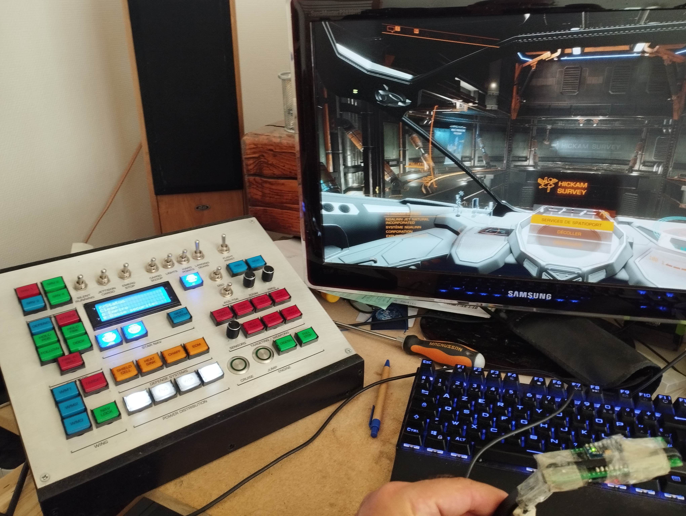
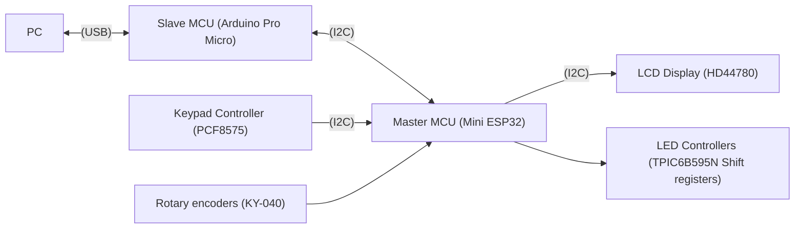

# EDControlPanel

## Features

* Webserver :
  * Wifi configuration
  * OTA updates (ElegantOTA)
  * Webserial logging and control
  * Control panel settings
* Game informations on LCD display
* Led controller (buttons statuses)
* Control through momentary switches, toggles, rotary encoders
* Communication from PC to control panel via a .NET application

## Components :

* Mini ESP32 v1 (Main MCU)
* Arduino Pro Micro (Communications MCU)
* PCF8575 (Keypad controller)
* TPIC6B595N shift registers (Led controllers)
* Buttons, toggle swithes, rotary encoders (cheap KY-040)
* LCD 20x4 display (HD44780, backed by PCF8574)

## Components Roles

* Arduino Pro Micro (Slave MCU) acts as the interface between PC and ESP32 (Master MCU).
  Its weak processing and memory capabilities are used only for data transfer and HID emulation of keyboard, and eventually, joystick
* PCF8575 is the keypad matrix controller
* 6 TPIC6B595N shift registers are used to drive the button's leds
* Mini ESP32 (Master MCU) handles panel logic, based on Slave MCU provided data, and drives LCD controller, keypad, leds (through the TPIC6B595N shift registers), and rotary encoders

## Connections

## TODO

### Must

* Document all libs and IPC Protocol
* Backup / restore configuration
* Add buttons wiring diagram. The actual implantation.svg doesn't show the 1N4148 diodes necessary for the keypad matrix to work.
* Add BOM

### Should

* Macro management (keys, conditions, delays...), configurable via web interface

### May
* Add missions infos
* Manage repairs
